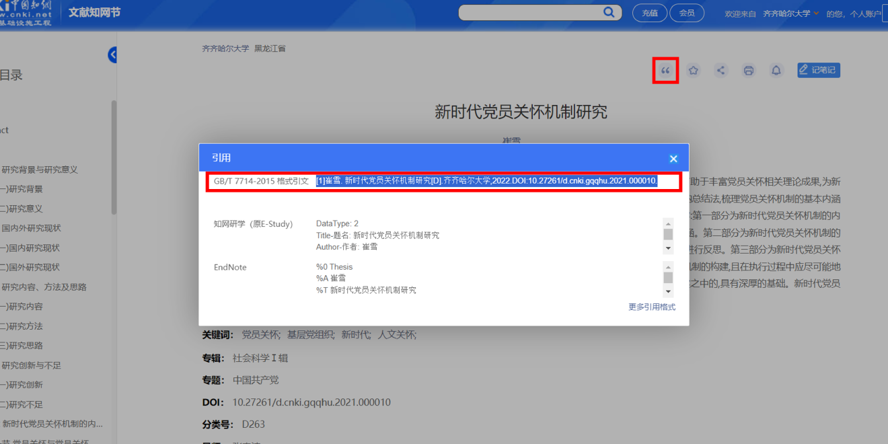
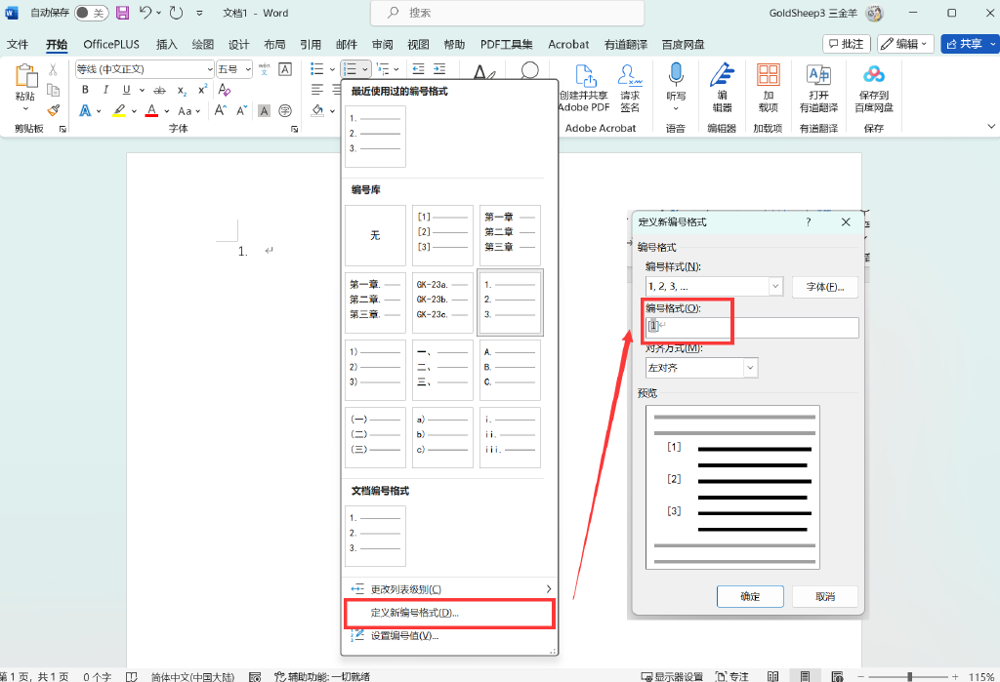
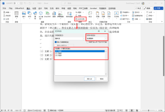
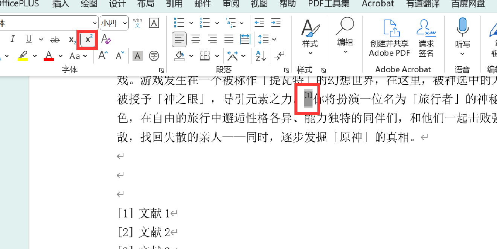

最近上课，有的老师和我们说论文格式的问题，说到了参考文献。思来想去，应该把这类规范记下来，自己查和给其他人看也都很方便。
这篇文章会随着了解不断更新。

## 参考文献的内容格式

我暂时还没有具体明白那些内容都有什么，但是科技的力量是强大的。
**注意，这类内容格式请找导师确认，或请教后和本格式对照修改。**

### cnki引用节生成

对于知网的内容，我们可以直接使用知网给出的格式引文。

如图所示，进入文献知网节之后，通过右上角的引号标志打开引用窗口，知网会自动选中这段引文，复制即可。
请注意，粘贴到Word后要删除前面的`[1]`。

### 参考文献格式生成器

这类生成器网上随处可见。我目前在使用的一个网页是：[http://youkud.com/tool/referance/index.html](http://youkud.com/tool/referance/index.html)。

按照网页上的内容，选择文献类型后填写内容即可。

## 文献引用操作：交叉引用

1.创建一个`[1]`格式的Word编号列表格式。

在【开始-段落】中，选中编号列表图案右侧倒三角，选择【定义新编号格式】；
在弹出的窗口中修改【编号格式】，删除空格和`.`，在左右输入`[`和`]`，点击确定。

2.使用新创建的编号列表填写参考文献。

先点击【开始-段落】的编号列表图案创建一个编号列表，随后点击倒三角，在弹出的菜单栏中选择刚刚创建的`[1]`格式。

3.在文中需要添加参考文献的位置选择【插入-链接-交叉引用】。

> 该设置也可以在【引用】中找到。

在【交叉引用】窗口中，【引用内容】选择【段落编号】，选择【引用哪一个编号项】中的对应文献，点击【插入】，方框数字就会被插入到你之前光标的所在位置。

4.设置为上标。

拖选交叉引用的`[1]`编号，点击上标，编号就变成右上角标的形式了。
