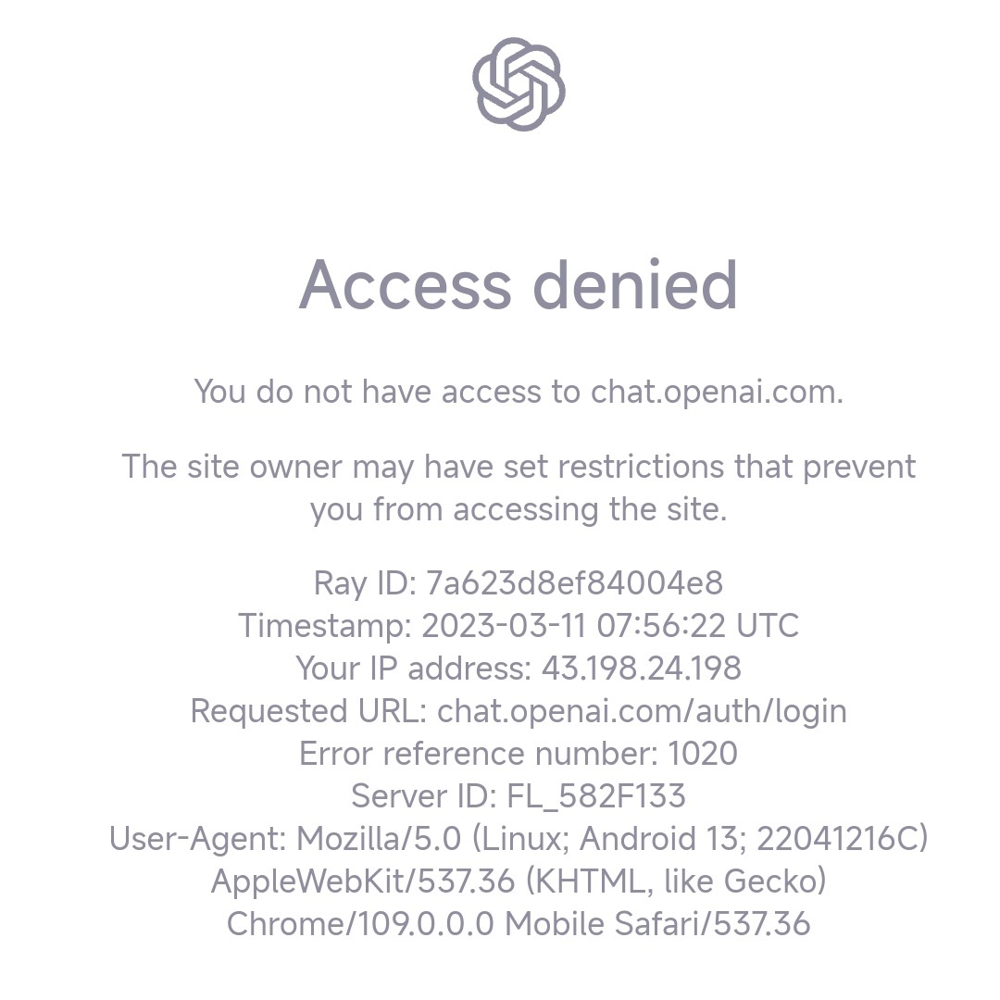

> 作业内容： 
> 
> 针对ChatGPT这个热点问题，可以选择某个方面（例如：安装、应用、使用、主要解决问题等等）选择一个点进行总结（并提供相应的资源链接），提交作业。作业形式不限，可以是文档（不超300字）、音频（不超5分钟）、视频（不超5分钟）等。

今天第一次上学校的Python课，果然是入门课。老师说的没错，这堂课适合0基础。所以老师留的作业很简单，也很自由（指刚开始没看出来ChatGPT和Python有什么关系）。

既然有作业，就顺手研究一下ChatGPT吧。据说这东西挺好玩（乐）

> ChatGPT是 OpenAI 开发的一项革命性的人工智能 ( AI ) 技术，允许聊天机器人以前所未有的准确性和流畅性理解生成类似人类的自然语言，是有史以来最大、最强大的语言模型，拥有1750 亿个参数，能够在一秒钟内处理数十亿个单词。
> 
> ChatGPT 是由 OpenAI 创建的对话式 AI 聊天机器人，它旨在回答问题、提供信息、解决一系列问题，并以类似人类的方式将回复反馈给您。

你知道吗：

## OpenAI的官方渠道

[chat.openai.com/](https://chat.openai.com/)，这是ChatGPT的官网。2月16日，OpenAI买下了一个域名[ai.com](https://ai.com)，如今这个域名会直接重定向跳转到ChatCPT官网。进入官网，注册账号后便可以使用ChatGPT。

but，真的有这么简单吗？

> You do not have access to chat.openai.com.    The site owner may have set restrictions that prevent you from accessing the site.
>
> 您无法访问chat.openai.com。网站所有者可能设置了阻止你访问这个网站。

中国地区（含港、澳、台）不能直接访问官网，所以需要一些手段。如果能够访问，你就可以登录/注册OpenAI账号了。



注册登录后，便可以进行聊天了。

## 一些其他的方法

普通用户而言，可以尝试[BigQuant](https://bigquant.com/)（调用ChatGPT的策略），[Merlin](https://merlin.foyer.work/)（ChatGPT搜索插件）等。

对于BigQuant，可以注册登录后，编写策略>新建>通用策略>空白notebook。每次对话的时候，在对话内容前加一行 `%%BigQuant_ChatGPT` 即可。

对于Merlin，见官网。

此外，你还可以用Visual Studio Code的ChatGPT插件，中文版由B站up主[@何时夕丶](https://space.bilibili.com/396774082)制作。你可以在VS Code的拓展商店找到。

## 具体的使用体验

在写这篇文章的时候，我就尝试了一下ChatGPT。实际体验来说，不太行。

使用的是VS Code插件的ChatGPT。
















## 写在后面

我对AI类的东西是很感兴趣的，包括之前的Novel AI、还有这个Chat GPT。不能不承认，这种AI引擎很强大，一旦有了足够的数据源，很多方面可以超越人类。不过，这需要足够的数据源——大量的数据，而这些数据都是人类所产出的。AI做不到无中生有，所以AI真的能代替人类吗？

有人对AI持完全反对的态度。可以理解，AI会带来很多改变——但如今拦不住。我更倾向的观点是，AI是人类的辅助工具，但仅仅是个辅助工具。这个世界充满了太多的不确定性，但我更乐于期待一切朝着最好的样子发展。

## 参考资料

- [2023]国内注册ChatGPT的方法(100%可用)[www.pythonthree.com/register-openai-chatgpt/](https://www.pythonthree.com/register-openai-chatgpt/)
- 国内使用ChatGPT的方法[www.pythonthree.com/how-to-use-chatgpt/](https://www.pythonthree.com/how-to-use-chatgpt/)
- 牛逼！ChatGPT 中文版 VS Code 插件来了！免登录、免注册[cloud.tencent.com/developer/article/2224164](https://cloud.tencent.com/developer/article/2224164)